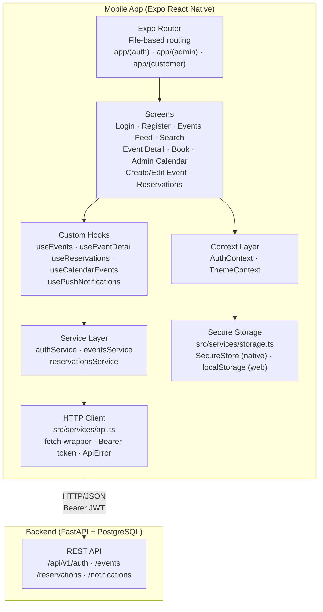
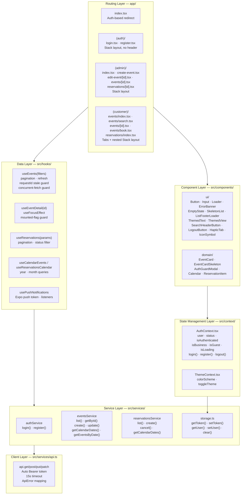
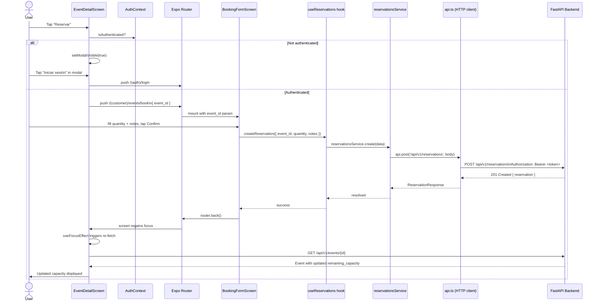
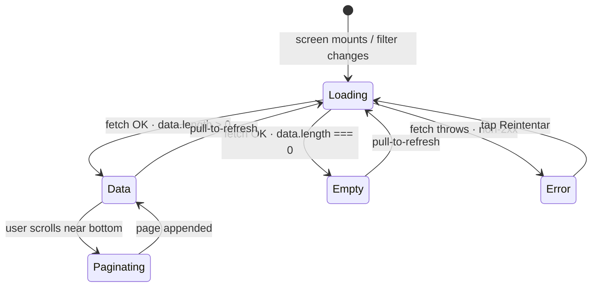

# Mobile Architecture — Event Booking

---

## Overview

Event Booking is a cross-platform mobile application built with **Expo React Native** that enables two types of users to interact with a shared event catalog:

- **Business users** (organizers) — create and manage events, view reservations per event through a calendar-based admin dashboard.
- **Customer users** (attendees) — browse the event feed, search with filters, make reservations, and manage their booking history.

The mobile app communicates exclusively with a **REST API** built with FastAPI + PostgreSQL (separate repository: `event-booking-api`). All business logic — capacity validation, role enforcement, notification creation — lives in the API. The mobile is responsible for presentation, navigation, session management, and user interaction.

---

## Project Structure

```
event-booking/
├── app/                              # Expo Router routes (file-based)
│   ├── _layout.tsx                   # Root layout — SafeAreaProvider + providers
│   ├── index.tsx                     # Auth-based redirect entry point
│   ├── (auth)/                       # Unauthenticated screens — Stack, no header
│   │   ├── _layout.tsx
│   │   ├── login.tsx
│   │   └── register.tsx
│   ├── (admin)/                      # Business user screens — Stack
│   │   ├── _layout.tsx
│   │   ├── index.tsx                 # Admin calendar dashboard
│   │   ├── create-event.tsx
│   │   ├── edit-event/[id].tsx
│   │   ├── events/[id].tsx
│   │   └── reservations/[id].tsx
│   └── (customer)/                   # Customer screens — Tabs + nested Stack
│       ├── _layout.tsx
│       ├── events/
│       │   ├── _layout.tsx
│       │   ├── index.tsx             # Event feed
│       │   ├── search.tsx            # Advanced search with filters
│       │   ├── [id].tsx              # Event detail + auth guard
│       │   └── book.tsx              # Booking form
│       └── reservations/
│           ├── _layout.tsx
│           └── index.tsx             # Customer reservations calendar
├── src/
│   ├── components/
│   │   ├── ui/                       # Pure, reusable UI components (13 files)
│   │   └── domain/                   # Domain-specific components (EventCard, AuthGuardModal, Calendar)
│   ├── context/                      # React Context providers (AuthContext, ThemeContext)
│   ├── hooks/                        # Custom data-fetching hooks (6 hooks)
│   ├── services/                     # API services + HTTP client + storage abstraction
│   ├── types/                        # Shared TypeScript interfaces (Event, Reservation, User...)
│   ├── constants/                    # UI strings, category colors/labels (ui.ts)
│   ├── utils/                        # Pure helper functions (dateHelpers.ts)
│   └── config/                       # API base URL resolution (api.ts)
├── tests/
│   ├── Unit/                         # Pure function tests — validators, formatters
│   ├── Feature/                      # Single-screen component tests with mocked API
│   ├── Browser/                      # Multi-step user flow tests
│   └── __mocks__/                    # Jest manual mocks for native modules
├── api-contracts/                    # OpenAPI YAML specs (auto-synced from backend CI)
├── docs/                             # Project documentation
│   ├── architecture/                 # ← this file
│   ├── modules/                      # Per-feature module docs
│   ├── development/                  # Commit standards, PR templates
│   └── test/                         # Testing guide
└── assets/                           # Fonts, images, icons
```

---

## High-Level Architecture Diagram



---

## Detailed Layer Diagram



---

## Layer Explanation

### 1. Routing Layer

**Location:** `app/`  
**Technology:** Expo Router 6 (file-based routing)

Every file inside `app/` maps directly to a route. Parenthesized folders create **route groups** — they segment the navigation tree without adding a URL segment.

| Group | Layout type | Purpose |
|---|---|---|
| `(auth)` | Stack (no header) | Login and registration screens |
| `(admin)` | Stack | Business user dashboard, event management |
| `(customer)` | Tabs → nested Stack | Customer event feed, search, booking, reservations |

**Entry point (`app/index.tsx`):** Reads `AuthContext.status` and immediately redirects:
- `loading` → renders nothing (splash)
- `guest` → `/(auth)/login`
- `business` → `/(admin)`
- `customer` → `/(customer)/events`

Route guards are enforced at the layout level: `(admin)/_layout.tsx` rejects non-business users; `(customer)/_layout.tsx` rejects unauthenticated users and redirects business users to admin.

---

### 2. Screen Layer

**Location:** files inside `app/(auth)/`, `app/(admin)/`, `app/(customer)/`

Screens are thin React components. They:
- Consume one or more custom hooks for data (never call services directly)
- Read auth state from `AuthContext`
- Handle navigation via `expo-router`'s `useRouter` / `useLocalSearchParams`
- Render reusable UI components from `src/components/`

**Key screens:**

| Screen | Route | Role |
|---|---|---|
| Login | `/(auth)/login` | Any |
| Register | `/(auth)/register` | Any |
| Admin Calendar | `/(admin)` | Business |
| Create Event | `/(admin)/create-event` | Business |
| Edit Event | `/(admin)/edit-event/[id]` | Business |
| Events Feed | `/(customer)/events` | Customer |
| Event Search | `/(customer)/events/search` | Customer |
| Event Detail | `/(customer)/events/[id]` | Customer |
| Booking Form | `/(customer)/events/book` | Customer |
| My Reservations | `/(customer)/reservations` | Customer |

---

### 3. Component Layer

**Location:** `src/components/`

Components are split into two sub-directories reflecting their scope of reuse.

#### `src/components/ui/` — Pure UI components

Stateless, domain-agnostic components that can be dropped into any screen. They receive data via props and emit events via callbacks, with no knowledge of the API or domain types.

| Component | Key Props | Description |
|---|---|---|
| `Button` | `title, onPress, variant` | Primary / secondary touchable button with loading state |
| `Input` | `value, onChangeText, placeholder` | Labeled text input with validation state |
| `Loader` | `message?` | Full-screen centered loading indicator |
| `ErrorBanner` | `message, onRetry, retryLabel?` | Inline error bar with retry button |
| `EmptyState` | `icon, title, subtitle` | Centered empty list state |
| `SkeletonList` | `count?, gap?` | Animated pulse placeholder list |
| `ListFooterLoader` | `loading, hasItems?` | Pagination spinner at list bottom |
| `ThemedText` | `type` | Color-scheme-aware text (`title`, `defaultSemiBold`, `link`) |
| `ThemedView` | — | Color-scheme-aware container |
| `SearchHeaderButton` | `color?` | Magnifying glass header icon → navigates to search screen |
| `LogoutButton` | — | Header logout action |
| `HapticTab` | — | Custom tab button with haptic feedback on press |
| `IconSymbol` | `name, size, color` | SF Symbols (iOS) / MaterialIcons (Android) abstraction |

#### `src/components/domain/` — Domain-specific components

Components that understand domain types (`Event`, `Reservation`) and contain business-aware rendering logic. They import from `src/types/` but must not call services or hooks directly — they receive data via props and fire callbacks.

| Component | Key Props | Description |
|---|---|---|
| `EventCard` | `event: Event, onPress?` | Large card with image, category badge, title, description, dates |
| `EventCardSkeleton` | — | Animated pulse placeholder at exact `EventCard` dimensions |
| `AuthGuardModal` | `visible, onClose, onLogin` | Non-intrusive modal intercepting unauthenticated booking attempts |
| `Calendar` | `markedDates, onDayPress` | Monthly calendar with dot markers per event/reservation count |
| `ReservationItem` | `reservation` | Row component for reservation list entries |

**Design principle:** `ui/` components have zero domain knowledge. `domain/` components encapsulate domain rendering but remain stateless — they are display-only and testable in isolation.

---

### 4. State Management Layer

**Location:** `src/context/`  
**Technology:** React Context API

**`AuthContext`** is the only global state store. It manages:

| Export | Type | Description |
|---|---|---|
| `user` | `AuthUser \| null` | Authenticated user (id, name, email, role) |
| `status` | `'loading' \| 'guest' \| 'business' \| 'customer'` | Session lifecycle state |
| `isAuthenticated` | `boolean` | Shorthand for `status !== 'guest'` |
| `isBusiness` | `boolean` | Shorthand for `status === 'business'` |
| `isGuest` | `boolean` | Shorthand for `status === 'guest'` |
| `isLoading` | `boolean` | True during initial session restoration |
| `login(data)` | `Promise<void>` | Authenticates, stores token + user |
| `register(data)` | `Promise<void>` | Registers, stores token + user |
| `logout()` | `void` | Clears memory state + secure storage |

**Session restoration:** On `AuthProvider` mount, the context reads the stored token and user from `storage.ts`. If both exist, the user is considered authenticated without a network call.

**`ThemeContext`** exposes `colorScheme` (system-detected) and a `toggleTheme` function. Theming affects `ThemedText` and `ThemedView` components.

---

### 5. Data Layer — Custom Hooks

**Location:** `src/hooks/`

Hooks encapsulate all data-fetching logic. Screens consume only the hook's public interface.

| Hook | Key params | Returns | Notable pattern |
|---|---|---|---|
| `useEvents(filters?)` | `search, category, date` | `events, loading, refreshing, error, hasNextPage, loadMore, refresh` | `requestId` stale-response guard; `useRef` concurrent-fetch guard |
| `useEventDetail(id)` | event UUID | `event, loading, error` | `useFocusEffect` instead of `useEffect` — re-fetches on every screen focus |
| `useReservations(params)` | `eventId?, search?, status?, page` | `reservations, loading, error, pagination` | Standard pagination |
| `useCalendarEvents(year, month)` | year, month | `dates, loading, error` | Calendar dot markers for admin |
| `useReservationsCalendar(year, month)` | year, month | `dates, loading, error` | Calendar dot markers for customer |
| `usePushNotifications()` | — | Registers Expo push token; sets up foreground listener | Expo Notifications SDK |

**`requestId` stale-response guard (inside `useEvents`):** A monotonic counter is incremented on every filter change. Each in-flight request captures the counter at dispatch time. When the response arrives, it is discarded if the stored `requestId` no longer matches — preventing race conditions when filters change before a request resolves.

---

### 6. Service Layer

**Location:** `src/services/`

Services are pure functions that translate app-level intent into HTTP calls. They have no access to React state and no side effects beyond network I/O.

| Service | Methods | Endpoints |
|---|---|---|
| `authService` | `login()`, `register()` | `POST /auth/login`, `POST /auth/register` |
| `eventsService` | `list()`, `getById()`, `create()`, `update()`, `getCalendarDates()`, `getEventsByDate()` | `GET/POST/PUT /events`, `GET /events/calendar` |
| `reservationsService` | `list()`, `create()`, `cancel()`, `getCalendarDates()` | `GET/POST /reservations`, `PATCH /reservations/{id}/cancel`, `GET /reservations/calendar` |

Image uploads (`create` and `update` events) use `multipart/form-data` with a `FormData` body — not JSON — to send the image binary alongside event fields.

---

### 7. HTTP Client

**Location:** `src/services/api.ts`

A thin wrapper around the native `fetch` API that applies cross-cutting concerns to every request:

- **Base URL resolution** — reads `EXPO_PUBLIC_API_URL` env var; falls back to Metro debugger host; platform defaults (`10.0.2.2:8000` on Android emulator, `localhost:8000` on iOS/web).
- **Bearer token injection** — reads the current token from `storage.ts` and appends `Authorization: Bearer <token>` automatically.
- **15-second timeout** — uses `AbortController` to cancel stalled requests.
- **`ApiError` mapping** — non-2xx responses are parsed into a typed `ApiError` class carrying `status`, `error` (machine code), `message` (human string), and `details` (field-level validation array from FastAPI).

---

### 8. Storage Layer

**Location:** `src/services/storage.ts`

Platform-aware key-value store for the session token and compact user object.

| Platform | Implementation | Security |
|---|---|---|
| iOS / Android | `expo-secure-store` | OS keychain / Keystore (encrypted at rest) |
| Web | `localStorage` | Browser storage (no encryption) |

**Stored keys:**

| Key | Value |
|---|---|
| `auth_token` | JWT string |
| `auth_user` | JSON-serialized compact user object |

---

## Data Flow: Booking a Reservation

The following sequence shows the complete round-trip from the user tapping "Reservar" on an event detail screen to the updated capacity being displayed.



---

## Technical Decisions

### 1. React Context API over Redux or Zustand

**Decision:** Global state is managed with React's built-in Context API instead of a third-party state library.

**Rationale:** The only truly global state in this application is the authentication session (one user object + one status enum) and the color scheme toggle. Both fit comfortably within Context without triggering performance issues. Adding Redux or Zustand would introduce boilerplate (reducers, slices, store config) and runtime overhead for a problem that does not require them.

**Trade-off:** Context re-renders all consumers when the value changes. If the app grew to include high-frequency updates (e.g., real-time capacity counters or chat messages), migrating to Zustand would be the natural next step. For the current feature set, the simplicity benefit outweighs this risk.

---

### 2. Custom hooks for data fetching (no cache library)

**Decision:** Data fetching is handled by hand-written custom hooks that call the service layer directly, with no caching library (no React Query, SWR, or Apollo).

**Rationale:** Each screen fetches its own data independently. There is no cross-screen cache invalidation requirement — when data changes (e.g., a reservation is created), the relevant screen re-fetches on next focus. This keeps the data layer simple and predictable.

**Trade-off:** There is no automatic background revalidation or cache sharing between screens. A future iteration with optimistic updates or real-time capacity would benefit from React Query's mutation + invalidation model.

---

### 3. `useFocusEffect` over `useEffect` for detail screens

**Decision:** `useEventDetail` and related detail hooks use `useFocusEffect` (from `@react-navigation/native`) instead of `useEffect` to trigger data fetches.

**Rationale:** `useEffect` runs once on mount. If a user navigates away (e.g., to the booking form) and returns, the component is still mounted — `useEffect` does not re-run. `useFocusEffect` fires every time the screen gains focus, ensuring the displayed data (capacity, reservation status) is always current without polling or manual refresh logic.

**Trade-off:** Every screen focus triggers a network call. For screens with stable data this is unnecessary overhead. A TTL-based invalidation strategy could optimize this in the future.

---

### 4. Auth guard modal over route redirect

**Decision:** When an unauthenticated user taps "Reservar" on an event detail screen, a modal appears instead of an immediate redirect to login.

**Rationale:** The user is on the event detail page because they were interested in the event. Redirecting them to login immediately discards that context. The modal lets them decide: log in to proceed, or dismiss and keep browsing. This is a less disruptive pattern for discovery flows.

**Trade-off:** Adds a component (`AuthGuardModal`) and a state variable (`modalVisible`) to the detail screen. The added complexity is minimal given the UX improvement.

---

### 5. Stale-request guard via `requestId` counter

**Decision:** `useEvents` maintains a monotonic `requestId` counter. Each fetch captures the counter at dispatch time and discards the response if the stored `requestId` has changed by the time the response arrives.

**Rationale:** The search screen changes filters rapidly (text debounce fires, then category chip changes, then date changes). Without a guard, an older slow request could overwrite the results of a faster newer request, showing the wrong data.

**Trade-off:** Adds a `useRef` to the hook. The logic is straightforward and confined to one file (`src/hooks/useEvents.ts`).

---

### 6. Platform-aware token storage

**Decision:** Token storage uses `expo-secure-store` on native platforms and `localStorage` on web, with the abstraction in `src/services/storage.ts`.

**Rationale:** `expo-secure-store` uses the OS keychain (iOS) and Android Keystore — the tokens are encrypted at rest and inaccessible to other apps. `localStorage` is the only persistent option on web, with the understanding that web builds are secondary targets.

**Trade-off:** Web builds have weaker token security. This is an accepted trade-off for the current development target (native devices).

---

### 7. File-based routing with Expo Router route groups

**Decision:** Navigation is defined entirely through the `app/` file system. Route groups `(auth)`, `(admin)`, and `(customer)` create isolated navigation subtrees.

**Rationale:** File-based routing eliminates manual route registration. Route groups allow each user role to have its own layout type (Stack for admin, Tab+Stack for customer, headerless Stack for auth) without polluting the URL. The root `index.tsx` acts as the single entry point for all redirects, keeping auth logic in one place.

**Trade-off:** Expo Router adds a runtime dependency. The typed routes feature (enabled via `experiments.typedRoutes`) catches navigation errors at compile time but requires an extra compilation step.

---

### 8. Consistent screen error-handling pattern

**Decision:** All list and detail screens implement the same 4-state visual pattern using shared components, rather than each screen defining its own error UI.

**Rationale:** Inconsistent error UX creates a fragmented experience and forces users to learn different recovery flows for different parts of the app. A single shared pattern also enables `ErrorBanner`, `SkeletonList`, `EmptyState`, and `ListFooterLoader` to be reused without modification across the feed, search, admin dashboard, and reservations screens.

**The pattern:**

| State | Trigger | Component shown |
|---|---|---|
| **Initial loading** | First fetch in-flight, no cached data | `SkeletonList` (n animated pulse cards via `ListEmptyComponent`) |
| **Paginating** | Subsequent pages loading, data already visible | `ListFooterLoader` (spinner below the last card) |
| **Data** | Fetch succeeded, `data.length > 0` | `FlatList` with domain rows (`EventCard`, `ReservationItem`) |
| **Empty** | Fetch succeeded, `data.length === 0` | `EmptyState` with contextual copy (different text for no-filter vs active-filter) |
| **Error** | Fetch threw `TypeError` or returned non-2xx | `ErrorBanner` above the list with message + "Reintentar" button |
| **Retry** | User taps "Reintentar" | Clears `error` state, re-runs the last fetch |



**Trade-off:** The pattern replaces the full content area on error — there is no partial recovery (e.g., keeping stale data visible while showing the error). This is intentionally simple; optimistic updates or stale-while-revalidate behavior would require a cache layer (e.g., React Query) not present in this project.

---

## Technology Justification

| Technology | Version | Role | Why this choice |
|---|---|---|---|
| **Expo SDK** | 54 | Runtime + native module layer | Provides a managed environment with pre-built native modules (camera, storage, notifications, haptics) without requiring native toolchains. Reduces setup to `npx create-expo-app`. |
| **Expo Router** | 6 | File-based navigation | Eliminates manual route registration. Route groups enable per-role layout isolation. Typed routes catch navigation errors at compile time. |
| **React Native** | 0.81.5 | UI rendering | Renders native iOS and Android components (not WebView) from a single TypeScript codebase. Shared logic eliminates the need for separate iOS and Android teams. |
| **TypeScript** | 5.9 | Type safety | Catches type errors at compile time, improves IDE autocomplete, and serves as living documentation for API contracts and component props. |
| **React Context API** | built-in | Global state | Sufficient for the auth session state that this app needs to share globally. No additional dependency or boilerplate. |
| **expo-secure-store** | 15.x | Token persistence | OS-backed encrypted storage (iOS Keychain, Android Keystore). Tokens are inaccessible to other apps and survive app restarts. |
| **dayjs** | 1.11 | Date formatting | Lightweight alternative to moment.js (~2KB). Used for calendar computations and human-readable date formatting in `es-CR` locale. |
| **react-native-reanimated** | 4.x | Animations | Runs animations on the UI thread via JSI, bypassing the JS bridge. Used for skeleton pulse animations and gesture-driven transitions. |
| **react-native-gesture-handler** | 2.x | Gesture detection | Required by Expo Router for swipe-back navigation. Runs gesture detection on the native thread for consistent 60fps response. |
| **expo-image** | 3.x | Image rendering | Optimized image component with built-in memory and disk cache, blurhash placeholder support, and better performance than React Native's `<Image>`. |
| **expo-image-picker** | 17.x | Image selection | Cross-platform camera roll access for event image uploads. Handles permissions transparently on iOS and Android. |
| **@testing-library/react-native** | 13.x | Component testing | Encourages testing from the user's perspective (by text, role, label) rather than implementation details. Reduces test brittleness on refactors. |
| **Jest + jest-expo** | 29 + 56 | Test runner | Jest is the standard in the React/React Native ecosystem. `jest-expo` provides the Expo-aware preset and mocks for native modules that don't run in Node.js. |

---

**Last updated:** 2026-06-12  
**Authors:** Justin Moreira, Abigail Ramírez, Luis Fernando Rosales, Luis Alejandro Salazar, Fabian Sanchez
